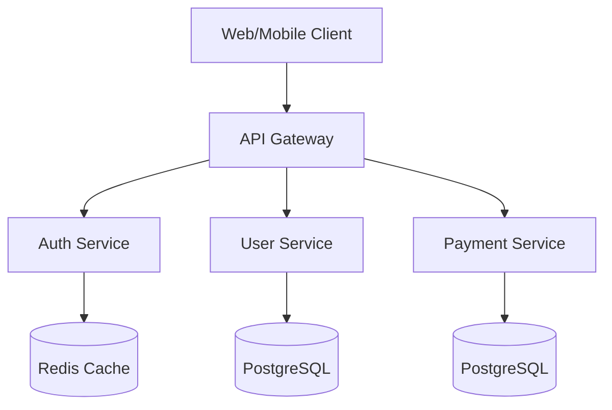

# Enterprise Architecture Blueprint

## 1. System Overview
A microservices-based architecture designed for high availability and horizontal scalability.

## 2. Component Diagram

## 3. Technology Stack
- **Frontend:** React, Next.js, TailwindCSS
- **Backend:** Node.js (Express), Go (High performance workers)
- **Database:** PostgreSQL, Redis
- **Infrastructure:** Kubernetes, AWS, Terraform
